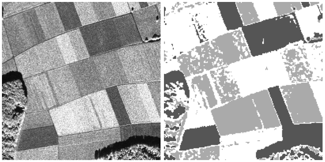

####Problem Setup

In this exercise, I will implement the EM algorithm and a finite mixture of multinomial distributions to approach the image segmentation problem. Image segmentation refers to the task of dividing an input image into regions of pixels that "belong together". The general approach is to extract a suitable set of features from the image and apply a clustering algorithm to them, while the clusters output can be regarded as the image segments. In this exercise, the features used are histograms drawn from small regions in the image, which can be represented by a number of multinomial distributions in a mixture model.

####EM Clustering of Histograms

A histogram can be regarded as a vector. If all input histograms have the same number of bins $d$, the set of input histograms can be regarded as a set of vectors in $\mathbb{R}^{d}$. 

The inputs of the EM algorithm are:

- A matrix of histograms denoted $H$, which contains one histogram vector in each row. Each column corresponds to a histogram bin
- An integer $K$ which specifies the number of clusters
- A threshold parameter $\tau$

The variables needed are:

- The input histogram row vectors denoted $\mathbf{H}_{1},...,\mathbf{H}_{n}$
- The centroids $\mathbf{t}_{1},...,\mathbf{t}_{K}$ in $\mathbb{R}^{d}$. Each centroid is the parameter vector of a multinomial distribution (and can be regarded as the center of a cluster); it is computed as the weighted averages of all features assigned to the cluster
- The matrix of assignment probabilities $\mathbf{a}_{1},...,\mathbf{a}_{n}$ as its row vectors, denoted $P$. Each of the vectors $\mathbf{a}_{i}$ is of length $K$, i.e. contains one entry for each cluster $k$. The entry ${a}_{ik}$ specifies the probability of feature $i$ to be assigned to cluster $k$

The EM algorithm iterates between the E-step, computation of the assignment probabilities $\mathbf{a}_{i}$, and the M-step, adjustment of the cluster parameters $\mathbf{t}_{k}$.

####The EM Algorithm

__1. Initialization:__ Choose $K$ of the histograms arbitrarily. These are my inital centroids $\mathbf{t}_{1},...,\mathbf{t}_{K}$

__2. Iteration:__

+ __E-step:__ Compute the components of each $\mathbf{a}_{i}$, the assignment probabilities ${a}_{ik}$, as follows:

$$\phi _{ik} = \text{exp}\,\left ( \sum_{j} H_{ij} \, \text{log}\left ( {t}_{kj} \right ) \right )$$
$$\mathbf{a}_{ik} = \frac{{c}_{k} \phi_{ik} }{ \sum_{l=1}^{K}{c}_{l}\phi_{il}}$$

$\phi_{ik}$ is the multinomial probability of $\mathbf{H}_{i}$ with parameters $\mathbf{t}_{k}$, up to the multinomial coefficient $\frac{n!}{H_{i1}!\cdots H_{id}!}$, which cancels out in the computations of ${a}_{ik}$. The weight ${c}_{k}$ is the relative cluster size (the proportion of histograms in cluster $k$).

+ __M-step:__ Compute new mixture weights ${c}_{k}$ and cluster centroids $\mathbf{t}_{k}$, as:

$${c}_{k} = \frac{\sum_{i=1}^{n} a_{ik}}{n} $$
$$\mathbf{b}_{k} = \sum_{i=1}^{n}a_{ik}\mathbf{H}_{i}$$
$$\mathbf{t}_{k} = \frac{\mathbf{b}_{k}}{\sum_{j=1}^{d}b_{kj}}$$

+ Compute a measure of the change of assignments during the current iteration: 

$$\delta = \left \| \mathbf{A}-\mathbf{A}^{\text{old}} \right \|$$

where $\mathbf{A}$ is the assignment matrix with entries ${a}_{ik}$, and $\left \| \cdot  \right \|$ is the matrix 1-norm.

__3. Threshold:__ Terminate the iteration when $\delta$ < $\tau$, since the current assignment matrix does not differ from that in the previous step by an extent greater than the pre-defined threshold.

__4. Reparameterization:__ Turn the soft assignments into a vector $\mathbf{m}$ of hard assignments by computing, for $i = 1, ..., n$:

$$m_{i} = \arg\max_{k=1,...,K} a_{ik}$$

i.e. the index $k$ of the cluster for which the assignment probability $a_{ik}$ is maximal.

####The Histogram Data

The histograms to be used are extracted from an image by the following procedure:

1. Select a subset of pixels, called _sites_, at which we will draw a histogram. Usually this is done by selecting the pixels at the nodes of an equidistant grid. (For example, a 2-by-2 grid means that we select every _second_ pixel in every _second_ row as a site.)

2. Place a rectangle of fixed radius around the site pixel.

3. Select all pixels within the rectangle and sort their intensity values into a histogram.

The data at hand was drawn from the 800x800 grayscale image shown below (left).



This type of image is well-suited for segmentation by histogram clustering, because the local intensity distributions provide distinctive information about the segments. The image on the right is an example segmentation using $K = 3$ clusters, computed with the EM algorithm described above.

The histograms here were drawn at the nodes of a 4-by-4 pixel grid. Since the image has 800x800 pixels, there are 200x200 = 40000 histograms. Each histogram was drawn within a rectangle of edge length 11 pixels, so each histogram contains 11x11 = 121 values. Since EM is computationally intensive with large dimensions, the number of bins can be reduced down to 16 from 256. 

####Algorithm Implementation

The histograms data can be loaded into R.

```{r}
H <- matrix(readBin("histograms.bin", "double", 640000), 40000, 16)
dim(H)  # each row is a histogram with 16 bins
rowSums(head(H))  # sum of each row should be 121
```

A snapshot of the histogram matrix:


The algorithm can be implemented as the `MultinomialEM()` function defined below. The function arguments are the input histograms `H`, number of clusters `K`, and threshold parameter `tau`. It avoids loops by clever use of matrix/vector operations in R.

```{r}
MultinomialEM <- function(H, K, tau) {
        ## Initialization
        # Generate a random vector of K indices to choose from the histograms as initial centroids
        init = sample(1:nrow(H), size = K, replace = F)
        # Select chosen histograms as centroid, a k-by-d matrix
        centroid = H[init, ]
        # To avoid taking log of zero, add a small constant to the centroids where bin is empty
        centroid = ifelse(centroid == 0, 0.01, centroid)
        # Initialize the measure of assignment threshold to be Inf
        delta = Inf
        # Initialize assignment probabilities matrix, n-by-k
        A = matrix(0, nrow(H), K)
        # Initialize centroid parameters matrix, n-by-k
        phi = matrix(0, nrow(H), K)
        # Arbitrarily initialize relative cluster size c, a vector of length K
        c = rep(1 / K, length.out = K)
        # Initialize an intermediate matrix b to update the t matrix
        b = matrix(0, K, ncol(H))
        # Initialize a hard assignment vector of length n 
        m = rep(0, length.out = nrow(H))
        # Use a while loop to implement the iteration and keep track of matrix A from previous step
        while (delta >= tau) {
                A_old = A
                ## E-step
                phi = exp(H %*% t(log(centroid)))
                A = t(c * t(phi)) / rowSums(t(c * t(phi)))
                ## M-step
                c = colSums(A)
                b = t(A) %*% H
                centroid = b / rowSums(b)
                ## Measurement of iteration
                delta = norm(A - A_old, type = "O")
        }      
        ## Reparameterization
        m <- apply(A, 1, FUN = which.max)
        return(m)
}  
```

The algorithm can be tried using the input data for `K = 3`, `K = 4`, and `K = 5`. The threshold value can be set reasonably at `tau = 0.1`. The segmentation result, the hard assignment vector $m$, can be visualized as an image.

```{r, fig.height = 5, fig.width = 5, out.height="400px", out.width="400px"}
set.seed(345)
em_1 <- MultinomialEM(H, 3, 0.1)
em_2 <- MultinomialEM(H, 4, 0.1)
em_3 <- MultinomialEM(H, 5, 0.1)
# Reset the histograms into their original "position" in the image, then visualize the result matrix in grayscale to represent the clustering
hist_1 <- matrix(em_1, 200, 200)
hist_2 <- matrix(em_2, 200, 200)
hist_3 <- matrix(em_3, 200, 200)
image(hist_1, col = gray((3:8) / 8), axes = FALSE)
```

This looks close to the given example of segmentation with `K = 3`. But the current image is not quite the same orientation as the example. Need to "flip" the matrix horizontally (and resulting in the image flipped vertically).

```{r, fig.height = 5, fig.width = 5, out.height="400px", out.width="400px"}
# Set the right orientation for the image function
# K = 3
image(hist_1[, ncol(hist_1):1], col = gray((3:8) / 8), axes = FALSE)
# K = 4
image(hist_2[, ncol(hist_2):1], col = gray((3:8) / 8), axes = FALSE)
# K = 5
image(hist_3[, ncol(hist_3):1], col = gray((3:8) / 8), axes = FALSE)
```

The visualization of larger $K$ value shows clearly sharper demarcation of regions of the image. Therefore, the algorithm is implemented successfully.

___Disclaimer: Adapted from Columbia University STAT 5241: Statistical Machine Learning problem set.___