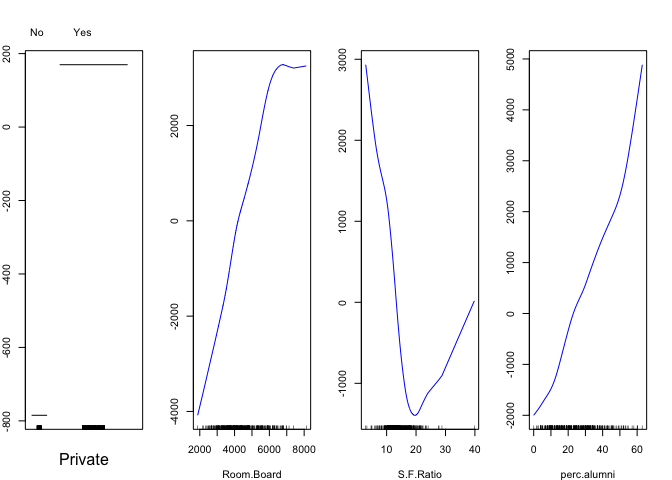
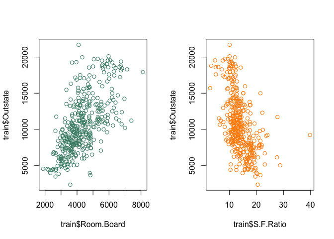
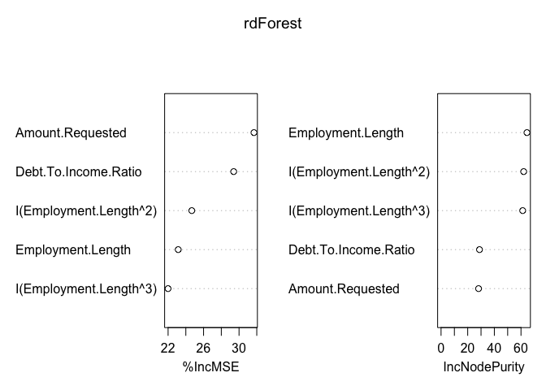

# Smoothing, Trees
Wen Fu  
November 22, 2015  
__1 Smooth nonlinear models for a continuous outcome__

Use the `College` dataset, do the following: 
* Split the data into a training set and a testing set in some appropriate fashion. Use the `lm()` and `step()` functions to obtain a decent linear model for `Outstate` in the training data that also includes whatever interactions you feel are appropriate.

* Use the `gam` function to fit a Generalized Additive Model where `Outstate` is the outcome using the predictors from your best model for the training data in previous part. 

* Which predictors, if any, exhibit a non-linear relationship with `Outstate`, conditional on the other predictors?

* Use the results to predict `Outstate` in the testing data. Is the average squared error in the testing data greater, less than, or about the same than in the training data? Why is that the case?


```r
stopifnot(require(ISLR))
```

```
## Loading required package: ISLR
```

```r
str(College)
```

```
## 'data.frame':	777 obs. of  18 variables:
##  $ Private    : Factor w/ 2 levels "No","Yes": 2 2 2 2 2 2 2 2 2 2 ...
##  $ Apps       : num  1660 2186 1428 417 193 ...
##  $ Accept     : num  1232 1924 1097 349 146 ...
##  $ Enroll     : num  721 512 336 137 55 158 103 489 227 172 ...
##  $ Top10perc  : num  23 16 22 60 16 38 17 37 30 21 ...
##  $ Top25perc  : num  52 29 50 89 44 62 45 68 63 44 ...
##  $ F.Undergrad: num  2885 2683 1036 510 249 ...
##  $ P.Undergrad: num  537 1227 99 63 869 ...
##  $ Outstate   : num  7440 12280 11250 12960 7560 ...
##  $ Room.Board : num  3300 6450 3750 5450 4120 ...
##  $ Books      : num  450 750 400 450 800 500 500 450 300 660 ...
##  $ Personal   : num  2200 1500 1165 875 1500 ...
##  $ PhD        : num  70 29 53 92 76 67 90 89 79 40 ...
##  $ Terminal   : num  78 30 66 97 72 73 93 100 84 41 ...
##  $ S.F.Ratio  : num  18.1 12.2 12.9 7.7 11.9 9.4 11.5 13.7 11.3 11.5 ...
##  $ perc.alumni: num  12 16 30 37 2 11 26 37 23 15 ...
##  $ Expend     : num  7041 10527 8735 19016 10922 ...
##  $ Grad.Rate  : num  60 56 54 59 15 55 63 73 80 52 ...
```

* I choose to include the following variables: `Private`, `Room.Board`, `S.F.Ratio`, and `perc.alumni`, but not any interaction terms. The `step()` model does not drop any variables from the the OLS model. 


```r
train <- College[1:388, ]
test <- College[389:777, ]
ols <- lm(Outstate ~ Private + Room.Board + S.F.Ratio + perc.alumni, data = train)
ols_subset <- step(ols, trace = FALSE)
setdiff(names(coef(ols)), names(coef(ols_subset)))
```

```
## character(0)
```

* After running GAM, the plots can be interpreted as follows: holding other variables fixed, `Outstate` for private colleges is higher than for public colleges; holding other variables fixed, `Outstate` increases as `Room.Board` increases, but it stops increasing as `Room.Board` goes above $6,000; holding other variables fixed, `Outstate` decreases as `S.F.Ratio` increases until it reaches around 20, but `Outstate` goes back up as `S.F.Ratio` goes above 20; holding other variables fixed, `Outstate` increases as `perc.alumni` increases, and the relationship is very close to linear.


```r
stopifnot(require(gam))
```

```
## Loading required package: gam
## Loading required package: splines
## Loading required package: foreach
## Loaded gam 1.12
```

```r
gam <- gam(Outstate ~ Private + s(Room.Board, 5) + s(S.F.Ratio, 5) + s(perc.alumni, 5), data = train)     
# The s() argument doesn't handle interactions well, so put the interactions directly in the model.
yhat <- predict(gam)
par(mfrow = c(1, 4), mar = c(4, 2, 4, 2))
plot(gam, col = "blue")
```

 

* As shown in the plots above, the `Room.Board` and `S.F.Ratio` variables seem to exhibit a non-linear relationship with `Outstate`. `Outstate` increases until `Room.Board` reaches near $6,000, and `Outstate` starts to decrease slightly before evening out. However, the number of observed `Room.Board` values above $6,000 is much smaller according to the scatterplot below, so the decrease in `Outstate` may be due to these outliers. 

`Outstate` decreases until `S.F.Ratio` reaches around 20. `Outstate` hits a minimum and increases again as `S.F.Ratio` continues to increase. The same outlier concern is present: The number of observed `S.F.Ratio` data points above 20 is much smaller, as is clearly illustrated in the scatterplot below. If these outlier data points were excluded, then the relationships may be closer to linear for both `Room.Board` and `S.F.Ratio`.


```r
par(mfrow = c(1, 2))
plot(train$Room.Board, train$Outstate, col = "aquamarine4")
plot(train$S.F.Ratio, train$Outstate, col = "darkorange")
```

 

* Interestingly, the mean prediction error in the testing data is smaller than the mean squared error in the training data. Compared to a linear model, the GAM is more flexible and provides a better fit in terms of least squares. 


```r
yhat_t <- predict(gam, newdata = test)
mean((train$Outstate - yhat)^2)
```

```
## [1] 5451074
```

```r
mean((test$Outstate - yhat_t)^2)
```

```
## [1] 5126546
```

__2 Tree-based models for a binary outcome__

These data are again from LendingClub.com but this time the outcome of interest is whether a loan was approved, rather than whether a loan was not repayed. 

* Split the data into a training set and a testing set in some appropriate fashion. Fit a logit model to the outcome in the training data, using whatever interaction and polynomial terms you feel are appropriate.

* Use different tree-based approaches to fit the outcome in the training data.

* Rank the three approaches in terms of which is most likely to yield a correct prediction in the testing data.


```r
#setwd()
load("dataset2.RData")
str(dataset)
```

```
## 'data.frame':	10000 obs. of  6 variables:
##  $ Amount.Requested    : num  5000 25000 4000 1500 1000 2500 5000 5000 12000 1500 ...
##  $ Debt.To.Income.Ratio: num  0.56 1.75 27.77 27.3 0.05 ...
##  $ Zip.Code            : chr  "945" "050" "110" "372" ...
##  $ State               : chr  "CA" "VT" "NY" "TN" ...
##  $ Employment.Length   : num  0 7 0 0 5 0 -1 0 0 10 ...
##  $ y                   : int  0 0 0 0 0 0 0 0 0 0 ...
```

* I choose to regress on the following variables, including a cubic polynomial on `Employment.Length`.


```r
training <- dataset[1:5000, ]
testing <- dataset[5001:10000, ]
logit <- glm(y ~ Amount.Requested + Debt.To.Income.Ratio + poly(Employment.Length, 3, raw = T), data = training, family = "binomial")
```

```
## Warning: glm.fit: fitted probabilities numerically 0 or 1 occurred
```

* __Bagging__

The total number of variables in my model is 5. First run a bagging model on the classification.


```r
stopifnot(require(randomForest))
```

```
## Loading required package: randomForest
## randomForest 4.6-12
## Type rfNews() to see new features/changes/bug fixes.
```

```r
bag <- randomForest(y ~ Amount.Requested + Debt.To.Income.Ratio + Employment.Length + I(Employment.Length ^ 2 ) + I(Employment.Length ^ 3), data = training, mtry = 5, importance = TRUE)
```

```
## Warning in randomForest.default(m, y, ...): The response has five or fewer
## unique values. Are you sure you want to do regression?
```

* __Boosting__


```r
stopifnot(require(gbm))
```

```
## Loading required package: gbm
## Loading required package: survival
## Loading required package: lattice
## Loading required package: parallel
## Loaded gbm 2.1.1
```

```r
boost <- gbm(y ~ Amount.Requested + Debt.To.Income.Ratio + Employment.Length + I(Employment.Length ^ 2 ) + I(Employment.Length ^ 3), data = training, distribution = "bernoulli", n.trees = 100, interaction.depth = 3)
```

* __Random Forest__


```r
rdForest <- randomForest(y ~ Amount.Requested + Debt.To.Income.Ratio + Employment.Length + I(Employment.Length ^ 2 ) + I(Employment.Length ^ 3), data = training, importance = TRUE)
```

```
## Warning in randomForest.default(m, y, ...): The response has five or fewer
## unique values. Are you sure you want to do regression?
```

```r
rdForest
```

```
## 
## Call:
##  randomForest(formula = y ~ Amount.Requested + Debt.To.Income.Ratio +      Employment.Length + I(Employment.Length^2) + I(Employment.Length^3),      data = training, importance = TRUE) 
##                Type of random forest: regression
##                      Number of trees: 500
## No. of variables tried at each split: 1
## 
##           Mean of squared residuals: 0.04469108
##                     % Var explained: 47.12
```

```r
varImpPlot(rdForest)
```

 

* The predictions of each classification model are as follows. According to the tables, the rank of accuracy of prediction in terms of classification error rate is bagging > logit > boosting.


```r
yhat_l <- predict(logit, newdata = testing, type = "response")
yhat_bg <- predict(bag, newdata = testing, type = "class")
yhat_bt <- predict(boost, newdata = testing, type = "response", n.trees = 100)
yhat_rf <- predict(rdForest, newdata = testing, type = "response")

correct_l <- mean((testing$y == 1) == (yhat_l > 0.5))
z_l <- as.integer(yhat_l > 0.5)
table(testing$y, z_l)
```

```
##    z_l
##        0    1
##   0 4407  137
##   1  288  168
```

```r
correct_bg <- mean((testing$y == 1) == (yhat_bg > 0.5))
z_bg <- as.integer(yhat_bg > 0.5)
table(testing$y, z_bg)
```

```
##    z_bg
##        0    1
##   0 4388  156
##   1  179  277
```

```r
correct_bt <- mean((testing$y == 1) == (yhat_bt > 0.5))
z_bt <- as.integer(yhat_bt > 0.5)
table(testing$y, z_bt)
```

```
##    z_bt
##        0
##   0 4544
##   1  456
```

```r
correct_rf <- mean((testing$y == 1) == (yhat_rf > 0.5))
z_rf <- as.integer(yhat_rf > 0,5)
table(testing$y, z_rf)
```

```
##    z_rf
##        1
##   0 4544
##   1  456
```

```r
round(c(logit = correct_l, bagging = correct_bg, boosting = correct_bt, RF = correct_rf), 3)
```

```
##    logit  bagging boosting       RF 
##    0.915    0.933    0.909    0.934
```

In this case, random forest has the highest proportion of correct predictions.
