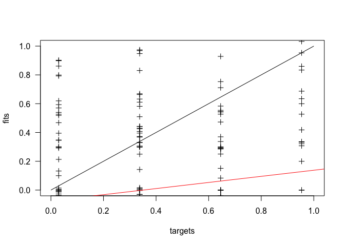

# Neural Networks and Other Models
Wen Fu  
December 6, 2015  
The two datasets on the characteristics and grades of some students have the same column names. The outcome of intest is `G3`, which is the year-end grade for the student. However, the students’ grades in the first dataset pertain to a math course while the students’ grades in the second dataset pertain to a language (Portuguese) course. You should use the `Math` dataset as the training data and the `Language` as the testing data. Use the `elman()` function in the `RNNS` package to fit a neural networks model to the training data using the default arguments. You can use any of the first __30__ variables to predict `G3` but should not use `G1` or `G2`. You will need to use the `model.matrix()` function to create the input matrix but include a -1 in the formula to omit a constant. Then, modify the `size` argument to the `elman()` function to find the neural networks model that predicts best in the testing data according to the average squared error criterion. Finally, use some model that we have discussed this semester besides a neural networks model that inputs the same predictors but produces better predictions in the testing data.

First import the data files and view the variables in the `Math (Language)` dataset.


```r
Math <- read.csv("student-mat.csv", sep = ";")
Language <- read.csv("student-por.csv", sep = ";")
all(colnames(Math) == colnames(Language))
```

```
## [1] TRUE
```

```r
str(Math)
```

```
## 'data.frame':	395 obs. of  33 variables:
##  $ school    : Factor w/ 2 levels "GP","MS": 1 1 1 1 1 1 1 1 1 1 ...
##  $ sex       : Factor w/ 2 levels "F","M": 1 1 1 1 1 2 2 1 2 2 ...
##  $ age       : int  18 17 15 15 16 16 16 17 15 15 ...
##  $ address   : Factor w/ 2 levels "R","U": 2 2 2 2 2 2 2 2 2 2 ...
##  $ famsize   : Factor w/ 2 levels "GT3","LE3": 1 1 2 1 1 2 2 1 2 1 ...
##  $ Pstatus   : Factor w/ 2 levels "A","T": 1 2 2 2 2 2 2 1 1 2 ...
##  $ Medu      : int  4 1 1 4 3 4 2 4 3 3 ...
##  $ Fedu      : int  4 1 1 2 3 3 2 4 2 4 ...
##  $ Mjob      : Factor w/ 5 levels "at_home","health",..: 1 1 1 2 3 4 3 3 4 3 ...
##  $ Fjob      : Factor w/ 5 levels "at_home","health",..: 5 3 3 4 3 3 3 5 3 3 ...
##  $ reason    : Factor w/ 4 levels "course","home",..: 1 1 3 2 2 4 2 2 2 2 ...
##  $ guardian  : Factor w/ 3 levels "father","mother",..: 2 1 2 2 1 2 2 2 2 2 ...
##  $ traveltime: int  2 1 1 1 1 1 1 2 1 1 ...
##  $ studytime : int  2 2 2 3 2 2 2 2 2 2 ...
##  $ failures  : int  0 0 3 0 0 0 0 0 0 0 ...
##  $ schoolsup : Factor w/ 2 levels "no","yes": 2 1 2 1 1 1 1 2 1 1 ...
##  $ famsup    : Factor w/ 2 levels "no","yes": 1 2 1 2 2 2 1 2 2 2 ...
##  $ paid      : Factor w/ 2 levels "no","yes": 1 1 2 2 2 2 1 1 2 2 ...
##  $ activities: Factor w/ 2 levels "no","yes": 1 1 1 2 1 2 1 1 1 2 ...
##  $ nursery   : Factor w/ 2 levels "no","yes": 2 1 2 2 2 2 2 2 2 2 ...
##  $ higher    : Factor w/ 2 levels "no","yes": 2 2 2 2 2 2 2 2 2 2 ...
##  $ internet  : Factor w/ 2 levels "no","yes": 1 2 2 2 1 2 2 1 2 2 ...
##  $ romantic  : Factor w/ 2 levels "no","yes": 1 1 1 2 1 1 1 1 1 1 ...
##  $ famrel    : int  4 5 4 3 4 5 4 4 4 5 ...
##  $ freetime  : int  3 3 3 2 3 4 4 1 2 5 ...
##  $ goout     : int  4 3 2 2 2 2 4 4 2 1 ...
##  $ Dalc      : int  1 1 2 1 1 1 1 1 1 1 ...
##  $ Walc      : int  1 1 3 1 2 2 1 1 1 1 ...
##  $ health    : int  3 3 3 5 5 5 3 1 1 5 ...
##  $ absences  : int  6 4 10 2 4 10 0 6 0 0 ...
##  $ G1        : int  5 5 7 15 6 15 12 6 16 14 ...
##  $ G2        : int  6 5 8 14 10 15 12 5 18 15 ...
##  $ G3        : int  6 6 10 15 10 15 11 6 19 15 ...
```

__Neural Networks__

Recode the `Medu`, `Fedu`, `traveltime`, `studytime` variables into categorical factors in both datasets.


```r
Math$Medu <- ordered(as.factor(Math$Medu), levels = 1:5, labels = c("none", "primary", "middle", "secondary", "higher"))
Math$Fedu <- ordered(as.factor(Math$Fedu), levels = 1:5, labels = c("none", "primary", "middle", "secondary", "higher"))
Math$traveltime <- ordered(as.factor(Math$traveltime), levels = 1:4, labels = c("<15", "15-30", "30-60", ">60"))
Math$studytime <- ordered(as.factor(Math$studytime), levels = 1:4, labels = c("<2", "2-5", "5-10", ">10"))
Language$Medu <- ordered(as.factor(Language$Medu), levels = 1:5, labels = c("none", "primary", "middle", "secondary", "higher"))
Language$Fedu <- ordered(as.factor(Language$Fedu), levels = 1:5, labels = c("none", "primary", "middle", "secondary", "higher"))
Language$traveltime <- ordered(as.factor(Language$traveltime), levels = 1:4, labels = c("<15", "15-30", "30-60", ">60"))
Language$studytime <- ordered(as.factor(Language$studytime), levels = 1:4, labels = c("<2", "2-5", "5-10", ">10"))
```

Include all of the first 30 variables into the neural network model after specifying the training and testing sets and scaling all of the values. Use the default arguments in the `elman()` function. 


```r
stopifnot(require(RSNNS))
```

```
## Loading required package: RSNNS
## Loading required package: Rcpp
```

```r
Training_input <- scale(model.matrix(G3 ~ . - G1 - G2, data = Math))
Training_target <- scale(model.response(model.frame(G3 ~ . - G1 - G2, data = Math)))
Testing_input <- scale(model.matrix(G3 ~ . - G1 - G2, data = Language))
Testing_target <- scale(model.response(model.frame(G3 ~ . - G1 - G2, data = Language)))
NNModel <- elman(Training_input[, -1], Training_target, inputsTest = Testing_input[, -1], targetsTest = Testing_target)
```

Plot the target values in the testing set against the predicted values in the testing set. Calculate the mean prediction error for this model.


```r
plotRegressionError(Testing_target, NNModel$fittedTestValues, pch = 3, las = 1)
```

 

```r
(MSE <- mean((Testing_target - NNModel$fittedTestValues)^2))
```

```
## [1] 1.556651
```

Without changing the input variables, iterate the model fitting with the `size` argument varying from 1 to 100. Record the mean prediction error from each iteration.


```r
MSEs <- numeric()
for(s in c(1:100)) {
        MSEs[s] <- mean((Testing_target - elman(Training_input[, -1], Training_target, size = s, inputsTest = Testing_input[, -1], targetsTest = Testing_target)$fittedTestValues)^2)
}
```

Plot the mean prediction errors. The smallest error occurs when `size = 2`. This is the neural network model that predicts best in the testing set according to the mean prediction error criterion. Usually it is better to have a higher number of hidden units, but in this case a relatively small number predicts the best.


```r
plot(MSEs, type = "l", xlab = "Size")
```

 

```r
which.min(MSEs)
```

```
## [1] 1
```

__Other Models__

Use multiple linear regression, GAM, and bartMachine models to make predictions using the same input variables.


```r
Training <- as.data.frame(cbind(Training_input, Training_target)[, -1])  # Adjust the object data format appropriate for these other models. lm() requires a data frame, not a matrix as that created for elman(). 
Testing <- as.data.frame(cbind(Testing_input, Testing_target)[, -1])
```

#####MLR

The mean prediction error is smaller than that from the best neural network model.


```r
MLR <- lm(V50 ~ ., data = Training)  # The last column in Training and Testing data frames is the target variable G3, automatically named as "V50" (50th column in the data frame).
Testing_MLR <- predict(MLR, newdata = Testing)
```

```
## Warning in predict.lm(MLR, newdata = Testing): prediction from a rank-
## deficient fit may be misleading
```

```r
mean((Testing$V50 - Testing_MLR)^2)
```

```
## [1] 0.9047454
```

#####GAM

The `freetime` and `goout` variables may be non-linearly related with the outcome, so use a smoothing spline for these variables in the GAM model. Again, the mean prediction error is smaller than both the neural network and MLR models.


```r
stopifnot(require(gam))
```

```
## Loading required package: gam
## Loading required package: splines
## Loading required package: foreach
## Loaded gam 1.12
```

```r
GAM <- gam(V50 ~ . - freetime + s(freetime) - goout + s(goout), data = Training)
Testing_GAM <- predict(GAM, newdata = Testing)
```

```
## Warning in predict.lm(object, newdata, se.fit, scale = 1, type =
## ifelse(type == : prediction from a rank-deficient fit may be misleading
```

```r
mean((Testing$V50 - Testing_GAM)^2)
```

```
## [1] 0.8993185
```

#####bartMachine

The mean prediction error is smaller than that from the neural network model, but bigger than both the MLR and GAM models.


```r
stopifnot(require(bartMachine))
```

```
## Loading required package: bartMachine
## Loading required package: rJava
## Loading required package: car
## Loading required package: randomForest
## randomForest 4.6-12
## Type rfNews() to see new features/changes/bug fixes.
## Loading required package: missForest
## Loading required package: itertools
## Loading required package: iterators
## Welcome to bartMachine v1.2.0! You have 0.53GB memory available.
```

```r
set_bart_machine_num_cores(parallel::detectCores())
```

```
## bartMachine now using 4 cores.
```

```r
Bart <- bartMachine(X = Training[, 1:49], y = Training$V50)
```

```
## bartMachine initializing with 50 trees...
## Now building bartMachine for regression ...
## evaluating in sample data...done
```

```r
Testing_Bart <- predict(Bart, new_data = Testing[, 1:49])
mean((Testing$V50 - Testing_Bart)^2)
```

```
## [1] 0.9878778
```

GAM has the best prediction with the smallest mean prediction error using all of the variables as inputs.
