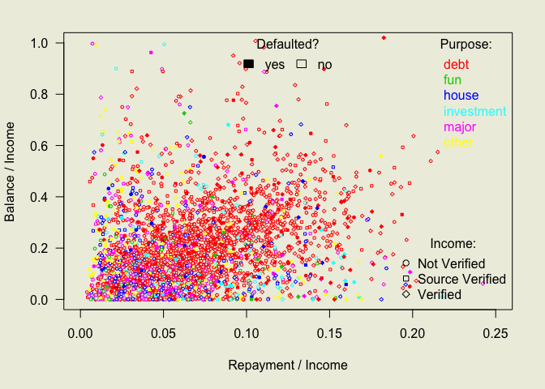

# Optimization, PCR, Classification Modeling
Wen Fu  
November 8, 2015  

__1 Optimization__
There are two `data.frames` that each contain 109 randomly selected observations on apartments for purchase in a Western European city in 2005. The dependent variable is `totalprice`, which is the purchase price of the apartment in Euros. There are 14 possible predictors (area, elevator, heating, etc.). Use the `training` data.frame to estimate models that are linear in their parameters and select the “best” such model according to which has the smallest average squared error when you predict `totalprice` in the `testing` data.

Then, write a function in R that inputs a numeric vector of proposals for the coefficients and outputs the sum of squared residuals. Finally, use the `optim()` function in R to find the parameters that minimize your function. Verify that they are quite similar to those obtained via `lm()`. 

##################
My best model was reached by running stepwise regression on the OLS model. The model is recreated below.


```r
#setwd()
training <- readRDS(gzcon(url('https://courseworks.columbia.edu/x/pJdP39')))
testing <- readRDS(gzcon(url('https://courseworks.columbia.edu/x/QnKLgY')))
ols <- lm(totalprice ~., data = training)
ols_subset <- step(ols, trace = FALSE)
```

Then, write a function that inputs a vector of proposed coefficients on predictors from the above model, and returns the sum of squared residuals based on the training dataset.


```r
X <- model.matrix(ols_subset)
y <- training$totalprice
SSR <- function(coef_ols) {
        y_hat <- X %*% coef_ols
        return(sum((y - y_hat)^2))
}
```

Then, use the `optim` function to find the minimum of the coefficients. 


```r
opt <- optim(rep(0, ncol(X)), fn = SSR, method = "BFGS")
```

Compare the above to the coefficient estimates from the stepwise regression model. They are quite similar.


```r
cbind(coef(ols_subset), opt$par)
```

```
##                         [,1]        [,2]
## (Intercept)       76430.2631  76432.1703
## area               1837.1574   1837.1447
## zoneZ21           69421.7558  69424.9778
## zoneZ31           63335.5405  63338.7359
## zoneZ32            8676.9794   8681.3638
## zoneZ34          -22241.9883 -22231.9953
## zoneZ35           20702.0137  20703.9750
## zoneZ36            7615.3589   7619.2960
## zoneZ37           41549.2730  41554.9813
## zoneZ38           -2491.2983  -2484.3424
## zoneZ41           32745.9965  32751.2023
## zoneZ42           45579.5509  45587.4238
## zoneZ43           12366.8300  12363.1564
## zoneZ44           -2279.8924  -2277.7845
## zoneZ45          -28165.1259 -28159.7758
## zoneZ46          -23871.9604 -23867.1750
## zoneZ47          -43641.6407 -43638.5002
## zoneZ48           16813.0652  16817.6769
## zoneZ49            4046.1168   4052.4545
## zoneZ52          -29503.4149 -29498.1513
## zoneZ53             814.9607    819.6644
## zoneZ56           -5959.9966  -5954.3934
## zoneZ61           -1957.5867  -1954.5000
## zoneZ62          -14388.5416 -14383.9398
## category2B        39652.2302  39647.6589
## category3A        31952.4828  31946.5974
## category3B        33695.1960  33689.0646
## category4A        23593.9752  23587.3160
## category4B         7951.6878   7944.0653
## category5A       -24830.3426 -24841.2690
## age                -481.0400   -480.9918
## toilets           14044.2069  14044.1840
## garage            23548.4186  23547.4589
## elevator          18089.1625  18088.4822
## streetcategoryS3  14817.1405  14817.6066
## streetcategoryS4   1775.7882   1777.5280
## streetcategoryS5  -6939.2709  -6938.6481
## heating3A        -35827.0739 -35827.1333
## heating3B          5975.1067   5974.6832
## heating4A        -19506.1028 -19505.2018
```

__2 Principle Components Regression__
Use the `pcr()` function in the `pls` R package to estimate a regression model on the training data where the outcome is the total price of the apartment and the predictors are all other variables in the trainingdata. Then,use the `predict()` function with `newdata` = `testing` to get a $N$ x 1 x $K$ array of predicted values for the price of the apartment in the testing data for a model that retains $k \leqslant K$ principal components of the $N$ x $K$ $\mathbf{X}$ matrix of predictors in the testing data. What value of $k$ yields the best predictive model under the average squared error criterion?

##################
First, fit a principal component regression model on the training dataset.


```r
stopifnot(require(pls))
```

```
## Loading required package: pls
## 
## Attaching package: 'pls'
## 
## The following object is masked from 'package:stats':
## 
##     loadings
```

```r
PCR <- pcr(totalprice ~ ., data = training)
```

Then, predict _totalprice_ values in the testing dataset, using up to _K_ = 48 components. The predictions are a 109 x 1 x 48 array.


```r
y_hatPCR <- predict(PCR, newdata = testing)
```

Then, find the _k_ value with the minimum mean prediction error.


```r
pred_k <- lapply(1:48, function(x) mean((testing$totalprice - y_hatPCR[, , x])^2))
which.min(pred_k)
```

```
## [1] 44
```

```r
min(as.numeric(pred_k))
```

```
## [1] 819654757
```

The predicted value when _k_ = 44 yields a lower mean prediction error than my best model.


```r
y_hatTT <- predict(ols_subset, newdata = testing)
with(testing, mean((totalprice - y_hatTT)^2))
```

```
## [1] 864167580
```

__3 Data Mining with Binary Outcome__
There will now be a `data.frame` with 6631 rows called `dataset` that has actual data on personal loans for 19 variables (including 18 IVs and 1 DV, the binary outcome which is 1 if the loan was defaulted on, charged off, very behind at the time the dataset was created, etc. and is 0 if the loan was (or is being) fully paid on time.

##################
_Summarise Data_


```r
#setwd()
load("dataset.RData")
str(dataset)
```

```
## 'data.frame':	6631 obs. of  19 variables:
##  $ loan_amnt          : int  5000 2400 5600 9000 10000 15000 4375 5000 9600 4400 ...
##  $ term               : Factor w/ 2 levels " 36 months"," 60 months": 1 1 2 1 1 1 1 1 1 1 ...
##  $ int_rate           : num  10.7 16 21.3 13.5 11.7 ...
##  $ installment        : num  162.9 84.3 152.4 305.4 330.8 ...
##  $ emp_length         : int  10 10 4 0 5 9 7 2 4 10 ...
##  $ home_ownership     : Factor w/ 4 levels "MORTGAGE","OTHER",..: 4 4 3 4 4 4 1 4 4 4 ...
##  $ annual_inc         : num  24000 12252 40000 30000 50000 ...
##  $ verification_status: Factor w/ 3 levels "Not Verified",..: 3 1 2 2 1 1 2 3 2 1 ...
##  $ purpose            : Factor w/ 14 levels "car","credit_card",..: 2 12 12 3 3 3 3 3 10 3 ...
##  $ zip_code           : Factor w/ 686 levels "010","011","012",..: 586 416 654 194 617 65 101 666 229 18 ...
##  $ addr_state         : Factor w/ 48 levels "AK","AL","AR",..: 4 15 5 43 5 32 32 35 38 37 ...
##  $ delinq_2yrs        : int  0 0 0 0 0 0 0 0 0 0 ...
##  $ earliest_cr_line   : num  1985 2001 2004 2004 2003 ...
##  $ inq_last_6mths     : int  1 2 2 1 0 1 0 0 0 0 ...
##  $ open_acc           : int  3 2 11 4 6 7 6 8 6 7 ...
##  $ pub_rec            : int  0 0 0 0 0 0 0 0 0 0 ...
##  $ revol_bal          : int  13648 2956 5210 10452 17800 5872 11210 2224 2896 25237 ...
##  $ total_acc          : int  9 10 13 9 17 11 12 16 11 11 ...
##  $ y                  : int  0 0 1 1 0 1 0 0 0 0 ...
```

It is possible to create a new variable that identifies the purpose/use of the loan. In this case, the new categories are major, debt, house, investment, fund, or other, as possible categories that define what people requested the loan for.


```r
dataset$purpose6 <- as.factor(with(dataset, 
                 ifelse(purpose %in% c("car", "major_purchase", "medical"), "major",
                 ifelse(purpose %in% c("credit_card", "debt_consolidation"), "debt",
                 ifelse(purpose %in% c("home_improvement", "house", "moving"), "house",
                 ifelse(purpose %in% c("educational", "renewable_energy", "small_business"), "investment",
                 ifelse(purpose == "other", "other",
                 ifelse(purpose %in% c("vacation", "wedding"), "fun", NA_character_))))))))
dataset$revol_bal_to_income <- dataset$revol_bal / dataset$annual_inc
dataset$installment_to_income <- dataset$installment * 12 / dataset$annual_inc

train <- dataset[1:3315, ]
test <- dataset[3316:6631, ]
```

_Plot_

Create a scatterplot between the ratios of `installment` (the amount of money the borrower is scheduled to pay each month) to `annual_inc` and `revol_bal` (the total revolving balance the borrower has) to `annual_inc`. The shape of the dots is defined by the verification status (__y__ being 0 or 1), the color of the dots is defined by the purpose of the loan.

```r
par(mar = c(5,4,2,2) + .1, las = 1, bg = "ivory2")
with(train, plot(installment_to_income, revol_bal_to_income, 
                    xlab = "Repayment / Income", ylab = "Balance / Income", 
                    pch = 20 + as.integer(verification_status), 
                    bg = ifelse(y == 0, 0, 1 + as.integer(purpose6)), 
                    col = 1 + as.integer(purpose6), cex = 0.5, xlim = c(0, 0.25), ylim = 0:1))
legend("topright", legend = levels(dataset$purpose6), text.col = 2:7, box.lwd = NA, 
       title = "Purpose:", title.col = 1, xjust = 1, inset = 0, bg = NA)
legend("bottomright", legend = levels(dataset$verification_status), pch = 21:23,
       title = "Income:", box.lwd = NA, xjust = 1, inset = 0, bg = NA)
legend("top", legend = c("yes", "no"), fill = 1:0, bg = NA,
       title = "Defaulted?", box.lwd = NA, ncol = 2)
```

 

_Logit Model_

First, run a logit regression on the training data and fit the same predictors with the testing data. 


```r
logit <- glm(y ~ loan_amnt * int_rate + term, data = train, family = binomial)
y_hatLogit <- predict(logit, type = "response", newdata = test)
summary(y_hatLogit)
```

```
##    Min. 1st Qu.  Median    Mean 3rd Qu.    Max. 
## 0.05810 0.09233 0.12260 0.13500 0.16030 0.43880
```

Then, classify the fitted values into the categories specified.


```r
z_logit <- as.integer(y_hatLogit > 0.5)
```

Compare the predictions with the actual values in the testing data.


```r
table(test$y, z_logit)
```

```
##    z_logit
##        0
##   0 2868
##   1  448
```


```r
2868 / (2868 + 448)
```

```
## [1] 0.8648975
```

It shows that this model correctly predicts the outcome in the testing data around 86% of the time.
